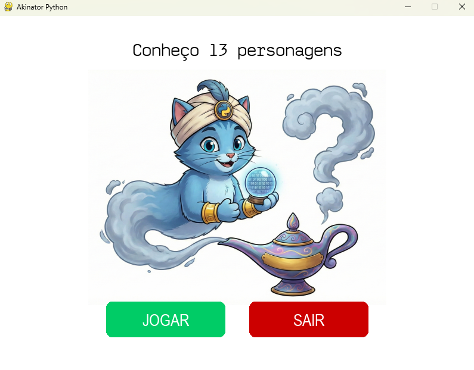
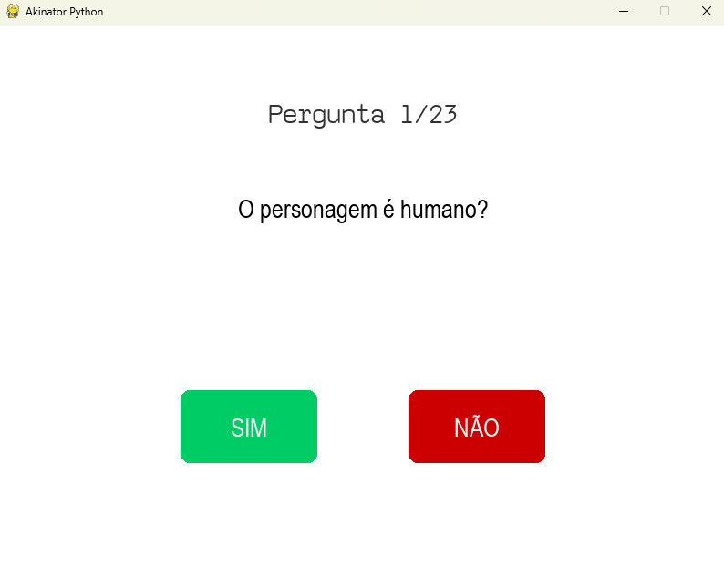

# 🧞‍♂️ Akinator Python - Algoritmo Naive Bayes

> Um clone do Akinator desenvolvido em Python que utiliza Probabilidade Bayesiana e Aprendizado de Máquina para adivinhar personagens e aprender com o usuário.


## 📋 Sobre o Projeto

Olá tudo bem? Meu nome é Isabela, desenvolvi este projeto como trabalho final da disciplina de **Introdução à Ciência da Computação (ICC)**. O objetivo é simular o jogo "Akinator", onde o computador tenta adivinhar em qual personagem o usuário está pensando através de uma série de perguntas "Sim" ou "Não".

O diferencial deste projeto é que ele **não utiliza uma árvore de decisão estática**. Ele usa um modelo probabilístico (Naive Bayes) que aprende dinamicamente. Se o computador errar, ele pede ao usuário para ensinar quem era o personagem e qual pergunta diferencia o chute errado do correto.

## 🚀 Funcionalidades

* **Interface Gráfica (GUI):** Desenvolvida com `pygame` para uma experiência visual interativa.
* **Cérebro Bayesiano:** Utiliza o Teorema de Bayes com Suavização de Laplace para calcular probabilidades.
* **Aprendizado Contínuo:**
    * Adiciona novos personagens automaticamente.
    * Cria novas perguntas dinamicamente para resolver conflitos entre personagens.
    * Reforça o conhecimento sobre personagens existentes a cada partida.
* **Parada Antecipada:** O algoritmo para de perguntar assim que a certeza estatística atinge um limiar seguro, tornando o jogo mais rápido.

## 📦 Estrutura do Projeto

```text
Projeto/
├── src/
│   ├── main_gui.py       # Loop principal e Interface Gráfica
│   ├── adivinhar.py      # Lógica matemática (Cálculo de Score/Probabilidade)
│   ├── jogo.py           # Versáo terminal(Console)
│   ├── aprendizado.py    # Lógica de escrita no CSV e atualização de pesos
│   ├── perguntas.py      # Gerenciador de perguntas
│   └── personagens.py    # Gerenciador de lista de personagens
├── data/
│   ├── dados_bayes.csv   # O "Cérebro" (Matriz de Pesos)
│   ├── personagens.csv   # Lista de nomes conhecidos
│   └── perguntas.csv     # Lista de perguntas e IDs
├── assets/               # Imagens e Fontes
│   ├── personagens/      # Fotos dos personagens (ex: Mario.png)
│   ├── akinator_logo.png
│   └── ...
└── README.md
```

## 🧠 Como Funciona (A Matemática)
O algoritmo calcula a probabilidade de cada personagem ser o escolhido baseando-se nas respostas dadas.

* **Naive Bayes com Logaritmos**
Para evitar underflow (números muito pequenos próximos de zero), utilizamos a soma de logaritmos em vez da multiplicação de probabilidades:

$$ Score = \sum \log(P(Resposta | Personagem)) $$

* **Suavização de Laplace (Add-1 Smoothing)**
Para garantir que o jogo funcione mesmo com poucos dados (ou quando um personagem nunca respondeu a uma pergunta específica), aplicamos a suavização:

$$ P(Sim) = \frac{\text{Contagem Sim} + 1}{\text{Total de Respostas} + 2} $$

Isso garante que a probabilidade nunca seja 0% ou 100%, permitindo que o sistema aprenda e corrija erros futuros.

## 🛠️ Como Rodar
* Pré-requisitos
Você precisa ter o Python instalado e a biblioteca Pygame.

Clone este repositório ou baixe os arquivos.

Instale a dependência:
``` bash
pip install pygame
```

## 🎮 Como Jogar
* Pense em um personagem (Fictício ou Real).

* Responda as perguntas clicando em SIM ou NÃO.

* O Akinator tentará adivinhar.

* Se ele acertar: Ótimo! O sistema reforça o aprendizado.

* Se ele errar:

   * Digite o nome do seu personagem.

   * Se for um conflito com outro personagem parecido, digite uma nova pergunta que diferencie os dois.

   * Responda a essa nova pergunta para o seu personagem.

   * Pronto! O Akinator aprendeu e não errará na próxima vez.
 
## 📸 Screenshots

| Imagem 1 | Imagem 2 |
|---------|----------|
|  |  |
| **Menu Principal** | **Tela de pergunta** |


